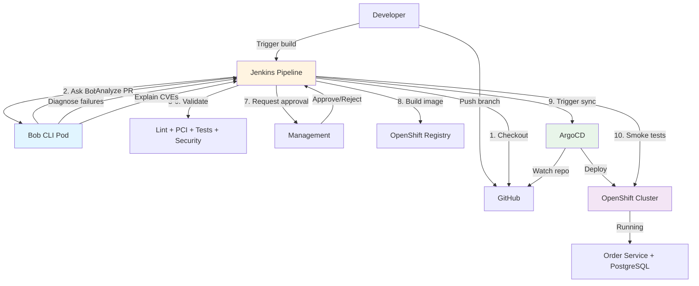
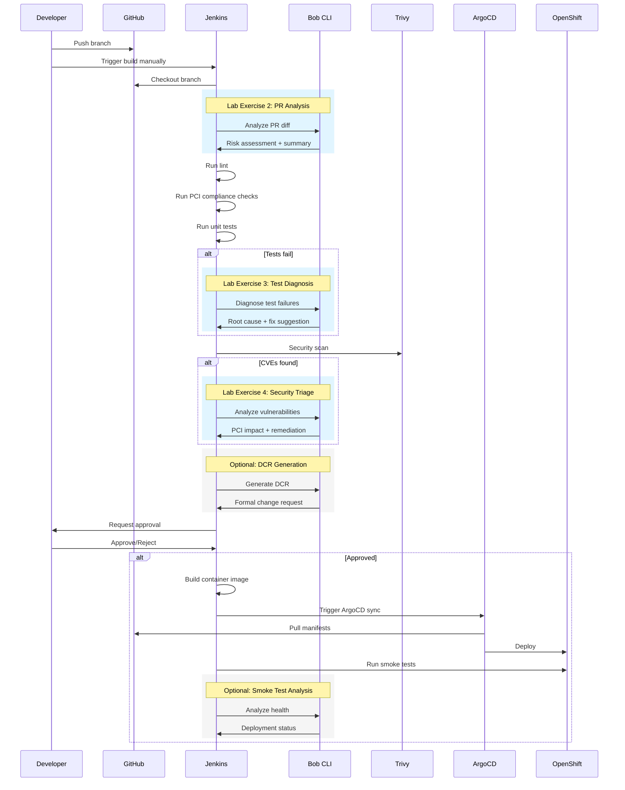

# SRE Deploy Lab

**AI-Assisted Regulated Deployment Pipeline for Financial Services**

A hands-on demonstration of how IBM Bob integrates into a production CI/CD pipeline for regulated environments. Watch Bob analyze pull requests, diagnose failures, generate deployment change requests, and validate compliance—all within a real Jenkins pipeline deploying to OpenShift.

---

## Tech Stack

- **Application**: Spring Boot 3.2, PostgreSQL 15, Maven
- **CI/CD**: Jenkins, ArgoCD (GitOps)
- **Platform**: OpenShift 4.18 (Kubernetes)
- **Security**: Trivy vulnerability scanner, custom PCI Checkstyle rules
- **AI**: IBM Bob CLI for analysis and automation

---

## What This Demonstrates

This lab teaches you to integrate IBM Bob into a Jenkins pipeline at three critical points. By the end, you'll have:

**Core Integration (Lab Exercises):**
1. **Bob PR Analysis** → Analyzes code changes before checks run, identifies risks
2. **Bob Test Diagnosis** → Explains test failures with root cause and fix suggestions
3. **Bob Security Triage** → Analyzes CVEs and explains PCI compliance impact

**Optional Extensions:**
4. **Bob DCR Generation** → Creates formal Deployment Change Request with risk assessment
5. **Bob Smoke Test Analysis** → Validates post-deployment health

### The Pipeline Flow

1. **Checkout** → Pull PR branch from GitHub
2. **Bob PR Analysis** → Bob reviews the diff (Lab Exercise 2)
3. **Lint** → Standard code quality checks
4. **PCI Compliance** → Custom rules for regulated environments
5. **Unit Tests** → Run tests, Bob diagnoses failures (Lab Exercise 3)
6. **Security Scan** → Trivy finds CVEs, Bob explains impact (Lab Exercise 4)
7. **Approval Gate** → Human reviews (optionally with Bob-generated DCR)
8. **Build Image** → Package application into container
9. **Deploy via ArgoCD** → GitOps sync to OpenShift
10. **Smoke Tests** → Validate deployment health (optionally with Bob analysis)

### Real-World Use Cases

- **Failure diagnosis**: Bob turns raw stack traces and CVE tables into actionable fixes
- **Compliance automation**: Bob explains PCI DSS violations in regulatory terms
- **Risk assessment**: Bob evaluates all validation results and recommends approve/reject
- **Environment configuration**: Bob generates environment-specific properties files

---

## Architecture



---

## Pipeline Flow with Bob Integration



---

## Key Features

### 🤖 AI-Assisted Failure Diagnosis
- **PR Analysis**: Bob reviews code changes and identifies risks before checks run
- **Test Diagnosis**: Bob explains test failures with root cause and specific fix suggestions
- **Security Triage**: Bob analyzes CVEs and explains PCI compliance impact with remediation steps

### 🔒 PCI Compliance Validation
- Custom Checkstyle rules for PCI DSS requirements
- Detects hardcoded credentials, insecure logging, weak cryptography
- Bob explains violations in regulatory terms

### 📋 Optional: Change Management Automation
- Bob can generate formal Deployment Change Requests (DCRs)
- Includes change description, risk level, affected services, rollback plan
- Provides recommendation with justification for approval gates

### ⚙️ Environment Configuration Support
- Bob analyzes application code to determine required properties
- Generates environment-specific configuration files (dev, staging, prod)
- Explains each setting and why it matters for production

---

## Project Structure

```
├── order-service/        # Spring Boot CRUD API (the application)
│   ├── src/             # Java source code
│   ├── Dockerfile       # Container image definition
│   └── pom.xml          # Maven build configuration
│
├── k8s/                 # Kubernetes manifests
│   ├── *-deployment.yaml
│   ├── *-service.yaml
│   └── openshift/       # Setup scripts for OpenShift
│
├── pipeline/            # CI/CD pipeline configurations
│   ├── pci-checkstyle.xml    # PCI compliance rules
│   └── smoke-test.sh         # Post-deployment validation
│
├── labs/                # Hands-on lab exercises
│   └── LAB_BOB_PIPELINE.md   # Add Bob to your pipeline
│
├── Jenkinsfile          # Complete 10-step pipeline
├── Makefile             # All commands as make targets
├── SETUP.md             # Detailed setup guide
└── README.md            # This file
```

---

## Learning Path

1. **[SETUP.md](SETUP.md)** — Deploy the lab environment to OpenShift (~20 minutes)
2. **[LAB_BOB_PIPELINE.md](labs/LAB_BOB_PIPELINE.md)** — Add Bob integration to the pipeline (~30 minutes)
3. **Run demo scenarios** — Test the three branches to see Bob in action
4. **Explore optional labs** — MCP integration, custom modes, skills (labs/optional/)

---